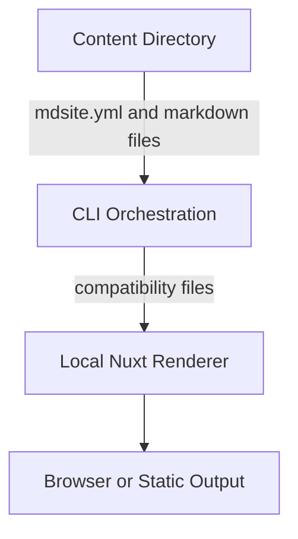

# Project Architecture

This tutorial explains the high-level design of MD-Site. You will understand why content is separated from the renderer and how data flows from a Markdown file to the browser.

## 1. The Core Philosophy: Separation of Concerns

This project is built on a strict separation:

*   **The Content (Data)**: Markdown files (`.md`), images, and `mdsite.yml`. These live in the content directory where you run the CLI.
*   **The Renderer (Code)**: The local Nuxt renderer. It knows *how* to display a page, but it doesn't know *what* the page is until runtime or build time.

**Why?**
This allows content projects to use the same local renderer while keeping site content and configuration in their own directories.

## 2. The Data Flow

When you run `mdsite start` or `mdsite generate` from a content directory, the CLI prepares renderer compatibility files and then runs the local Nuxt renderer:

### Step 1: Content-directory configuration
`mdsite.yml` is the active configuration file. `mdsite init` creates it and derives defaults from local markdown files.

### Step 2: CLI orchestration
The CLI prepares compatibility artifacts such as `_menu.yml`, `mdsite-nuxt/.env`, and `mdsite-nuxt/content.config.yml` before running the renderer.

### Step 3: Renderer execution
`mdsite start` runs the renderer in the foreground by default, while `mdsite start -d` runs a tracked background renderer. `mdsite generate` writes static output under `server.output`, and `mdsite preview` previews a generated build.

Renderer resolution is local-only. If `server.path` is missing for `start`, `generate`, or `preview`, the CLI falls back to the checked-in `mdsite-nuxt/` renderer. It does not clone or pull a renderer as active workflow.

## 3. Technology Stack

*   **Framework**: Nuxt 4 (Vue 3)
*   **Styling**: Vuetify (Material Design) with custom CSS variables for theming.
*   **Build Tool**: Vite.
*   **Language**: TypeScript.

---

> [!TIP]
> **Output**: You should now see that this is not just a "Nuxt app", but a custom Static Site Generator (SSG) pipeline built *on top* of Nuxt.
