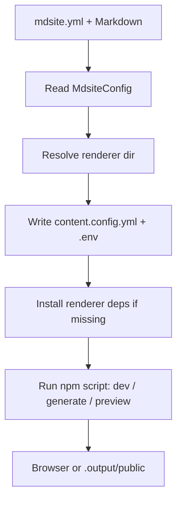

# Developing mdsite

This page is for contributors working on `mdsite` itself. End users do not need to read this; they should follow [Install](index.md) and the user-facing tutorials.

`mdsite` is a small repo made of two parts:

1. A **TypeScript CLI** (`src/`) that orchestrates a content directory.
2. A **Nuxt renderer** (`mdsite-nuxt/`), pulled in as a git submodule, that turns Markdown into a static site.

The rest of this page maps the repository, explains how the two parts integrate, and links to deeper topics.

- [Renderer (mdsite-nuxt submodule)](develop/nuxt) — what the submodule is, how to customize it, how to add Nuxt components.
- [Testing](develop/tests) — how to run the test suite and how it is configured.
- [Release](develop/release) — how to publish a new version of `@life-and-dev/mdsite`.

## 1. Repository layout

```sh
mdsite/
├── bin/                # npm "bin" entry — thin launcher that imports dist/index.js
├── src/                # CLI source (TypeScript)
│   ├── index.ts        # CLI entrypoint + command dispatch
│   ├── commands/       # One module per CLI command (init, start, generate, ...)
│   ├── config/         # mdsite.yml schema, defaults, and menu parsing
│   ├── process/        # Foreground/background child-process and runtime-state helpers
│   └── renderer/       # Renderer preparation: env, compat files, npm install, run
├── scripts/            # Repo scripts in TypeScript: dev alias, release versioning, package verification
├── tsconfig.scripts.json # Type-checks scripts/*.ts (extends tsconfig.json, noEmit)
├── mdsite-nuxt/        # git submodule — the Nuxt renderer (see below)
├── docs/               # This documentation, served as the demo content
├── mdsite.yml          # Config for the docs/ content directory
├── package.json        # CLI package (@life-and-dev/mdsite)
├── tsconfig.json
└── vitest.config.ts    # CLI test config (includes src/**/*.test.ts)
```

The published npm package contains only `bin/`, `dist/`, `mdsite-nuxt/`, and `README.md` (see the `files` field in `package.json`). Everything else is repo-only.

## 2. The mdsite-nuxt git submodule

`mdsite-nuxt/` is a git submodule pinned in [`.gitmodules`](https://github.com/life-and-dev/mdsite/blob/main/.gitmodules):

```ini
[submodule "mdsite-nuxt"]
    path = mdsite-nuxt
    url = https://github.com/life-and-dev/mdsite-nuxt
```

The submodule lives in its own repository at [life-and-dev/mdsite-nuxt](https://github.com/life-and-dev/mdsite-nuxt) and is pinned to a specific commit by the parent repo. The CLI never clones or pulls it at runtime — it expects the submodule to already be checked out in the working tree (or vendored into the published package).

### Working with the submodule

After a fresh clone of this repo, initialise the submodule:

```bash
git clone --recurse-submodules https://github.com/life-and-dev/mdsite.git
# or, if already cloned:
git submodule update --init --recursive
```

To update the renderer to a newer version:

```bash
cd mdsite-nuxt
git fetch origin
git checkout <desired-commit-or-tag>
cd ..
git add mdsite-nuxt
git commit -m "chore: bump mdsite-nuxt submodule"
```

The parent repo records the submodule by commit SHA, so this bump is a normal commit on the parent.

See [Renderer (mdsite-nuxt submodule)](develop/nuxt) for how to customize the renderer or extend it with custom Nuxt components.

## 3. CLI architecture

The CLI is a thin orchestrator. It does not contain any rendering logic — all rendering happens inside `mdsite-nuxt`. The CLI's job is to:

1. Read `mdsite.yml` from the content directory.
2. Resolve which renderer directory to use.
3. Write compatibility artifacts into that renderer directory.
4. Spawn the renderer's npm scripts (`dev`, `generate`, `preview`) with the right environment.

### Module breakdown

| Path            | Responsibility                                                                                                                                                                      |
| --------------- | ----------------------------------------------------------------------------------------------------------------------------------------------------------------------------------- |
| `src/index.ts`  | CLI entrypoint. Parses `process.argv`, dispatches to a command handler.                                                                                                             |
| `src/commands/` | One file per command. Each handler takes a content directory (and options) and returns a status string.                                                                             |
| `src/config/`   | Defines the `MdsiteConfig` schema, default values produced by `init`, and the `menu` parser for `mdsite.yml`'s `menu:` section.                             |
| `src/process/`  | `child-process.ts` wraps foreground and background spawning. `runtime-state.ts` writes tracked-detached runtime state (PIDs/logs) into the renderer working dir (`<server.path>`).                                 |
| `src/renderer/` | `mdsite-nuxt.ts` is the bridge: it resolves the renderer directory, installs its dependencies if missing, writes `.env` and `content.config.yml`, and invokes the right npm script. |

Each module ships next to a `*.test.ts` file (for example `src/index.test.ts`, `src/commands/prepare.test.ts`). See [Testing](develop/tests) for the full picture.

## 4. How the CLI and Nuxt integrate

When a user runs `mdsite live`, `mdsite generate`, or `mdsite static` from a content directory, the CLI performs the same preparation phase before invoking the renderer:



### Step 1: Read config

`src/config/mdsite-config.ts` parses `mdsite.yml` into a typed `MdsiteConfig`. Defaults come from `src/config/default-mdsite-config.ts`, which `init` uses to seed a new file.

### Step 2: Resolve the renderer directory

Renderer resolution is **dev-aware**:

- **Dev repo / submodule in place** — when the bundled renderer is the local `mdsite-nuxt/` submodule and is NOT inside `node_modules` (the normal case in this repo), the CLI runs it **in place**, so live-editing of `mdsite-nuxt/` keeps working.
- **End users (`node_modules`)** — when the bundled renderer lives inside `node_modules` (an `npm install` / `npx` / CI run), the CLI **materializes** a copy into `<content-dir>/<server.path>` (default `.mdsite`) and runs there. The materialize copy preserves an existing committed `<server.path>/package.json` and `<server.path>/package-lock.json` so the lockfile pair can be version-controlled.
- If the resolved renderer directory has no `node_modules`, the CLI runs `npm install` in it.

`mdsite prepare github` never clones or pulls the renderer itself; the generated workflow is self-adapting and still expects `<server.path>` to be materializable in CI.

### Step 3: Write compatibility artifacts

The CLI writes two files into the resolved renderer directory so the renderer can find the content:

- `content.config.yml` — serialized site name, canonical URL, content path, git repo, features, and themes.
- `.env` — `NUXT_CONTENT_PATH`, `CONTENT_DIR`, and `MDSITE_CONFIG_PATH` so the renderer reads directly from the user's content directory without copying files.

The renderer reads the `menu:` section directly from `mdsite.yml` (via `MDSITE_CONFIG_PATH`).

### Step 4: Ensure dependencies

If the renderer directory has no `node_modules`, the CLI runs `npm ci` (when a lockfile is present) or `npm install` inside it. This is why the published package ships `mdsite-nuxt/` without `node_modules` — the install happens on first run.

### Step 5: Run the renderer script

Finally, the CLI spawns `npm run <script>` inside the renderer directory, where `<script>` is one of:

| CLI command       | Renderer script | Foreground | Background |
| ----------------- | --------------- | ---------- | ---------- |
| `mdsite live`    | `dev`           | yes        | with `-d`  |
| `mdsite generate` | `generate`      | yes        | —          |
| `mdsite static`  | `preview`       | yes        | with `-d`  |

Background runs are tracked via state files in the renderer working dir (`<server.path>`, e.g. `.mdsite/`) so `mdsite stop` can find and terminate them.

## 5. Configuration model

`mdsite.yml` is the only configuration file end users edit. The full schema is documented in the user-facing docs. From a developer perspective, the interesting pieces are:

- `src/config/mdsite-config.ts` — the TypeScript schema and parser.
- `src/config/default-mdsite-config.ts` — defaults applied by `init`, including theme palette and feature flags.
- `src/config/menu.ts` — the menu parser. Menu items are markdown file references; submenu keys (like `features:` or `develop:`) double as folder prefixes, so `features:` with item `bible-tooltips` resolves to `docs/features/bible-tooltips.md`.

## 6. Build artifacts and runtime state

| Path                             | Written by                       | Purpose                                              |
| -------------------------------- | -------------------------------- | ---------------------------------------------------- |
| `dist/`                          | `npm run build` (tsc)            | Compiled CLI loaded by `bin/mdsite.js`.              |
| `.<server.path>/` (e.g. `.mdsite/`)              | `start -d` / `preview -d`        | Tracked-detached runtime state: `start.json`/`preview.json` (PIDs, ports) + `start.log`/`preview.log`. |
| `.<server.path>/public/` (e.g. `.mdsite/public/`) | renderer favicon pipeline        | Generated `favicon.svg`/`favicon.ico`/`apple-touch-icon.png`/`icon-192.png`/`icon-512.png` + `site.webmanifest`. |
| `.output/public/`                | `mdsite generate` (via renderer) | The static site, ready to deploy.                    |
| `mdsite-nuxt/.env`               | every CLI run                    | Points the renderer at the active content directory. |
| `mdsite-nuxt/content.config.yml` | every CLI run                    | Serialized site config consumed by the renderer.     |

Most of these are gitignored. The exception is the committed lockfile pair `.<server.path>/package.json` + `.<server.path>/package-lock.json` (written by `mdsite init`); everything else under `.<server.path>/` and `.output/` is gitignored and should not be committed. The committed pair does not copy the bundled renderer's generic identity verbatim: `mdsite init` rewrites `package.json` `name` to the sanitized content-directory basename and `description` to `mdsite.yml`'s `site.name`, and syncs the same `name` into both `package-lock.json` name fields so `npm ci` won't rewrite (and dirty) the committed lockfile.

## 7. Technology stack

- **CLI**: TypeScript, Node.js standard library, `yaml` for config parsing.
- **Renderer**: Nuxt 4 (Vue 3), Vuetify (Material Design), `@nuxt/content`, Vite.
- **Tests**: Vitest for the CLI; the renderer has its own Vitest and Playwright configs.
- **Build**: `tsc` for the CLI; Nuxt/Vite for the renderer.

---

> [!TIP]
> MDsite is intentionally a thin CLI on top of Nuxt. If you find yourself adding rendering logic inside `src/`, it probably belongs in the [mdsite-nuxt submodule](develop/nuxt) instead.
